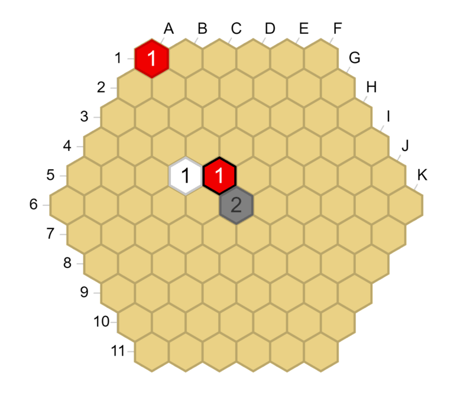
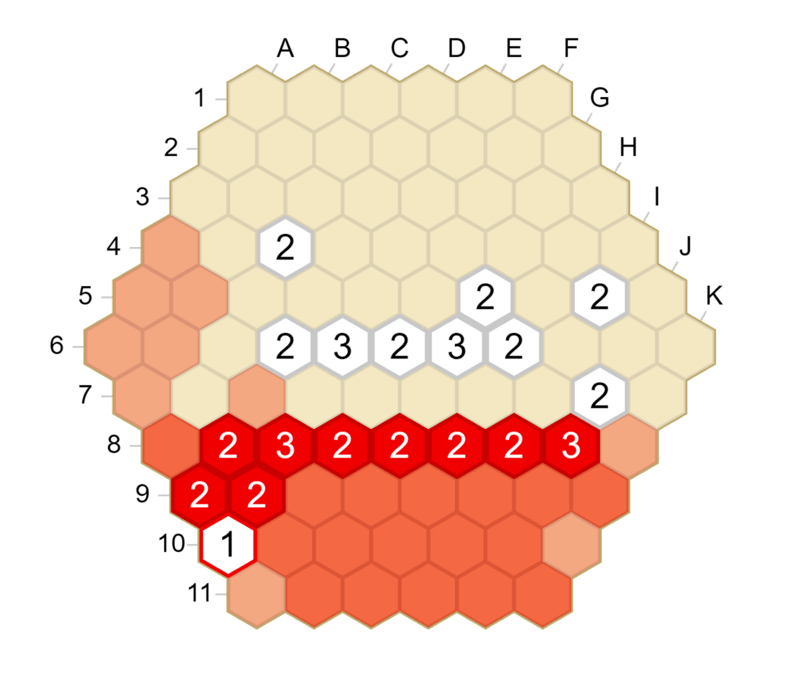
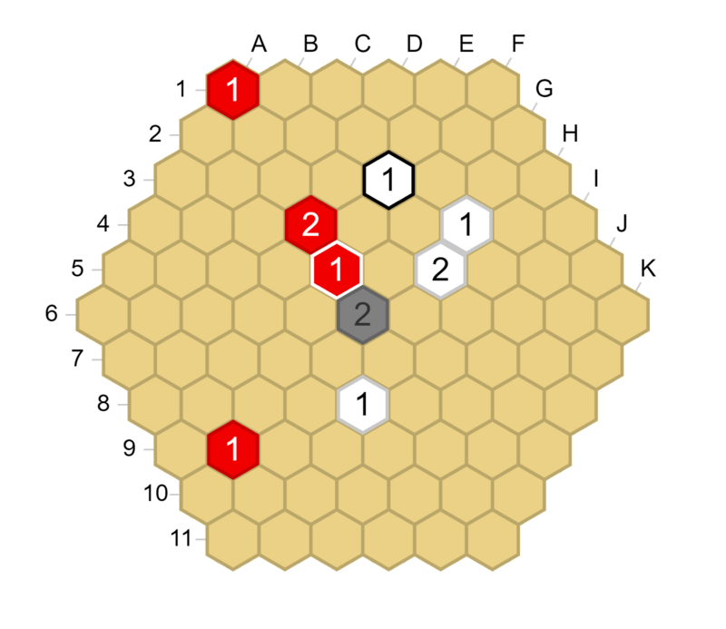
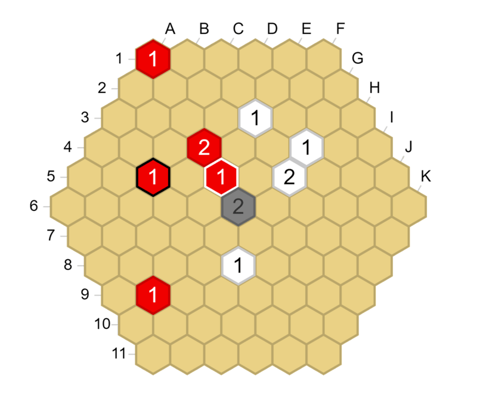
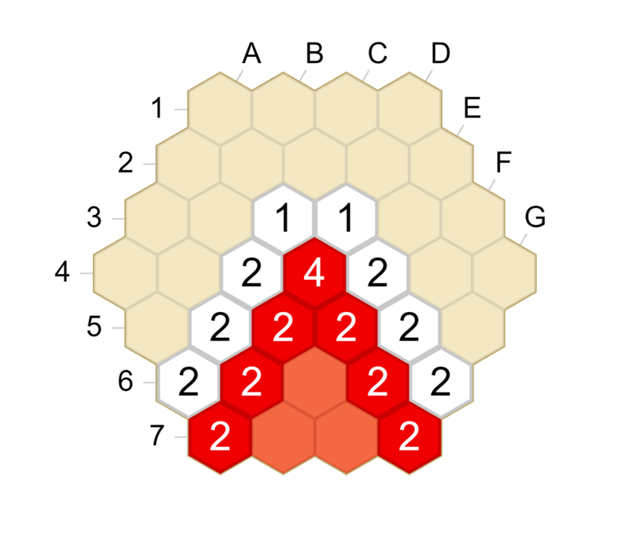
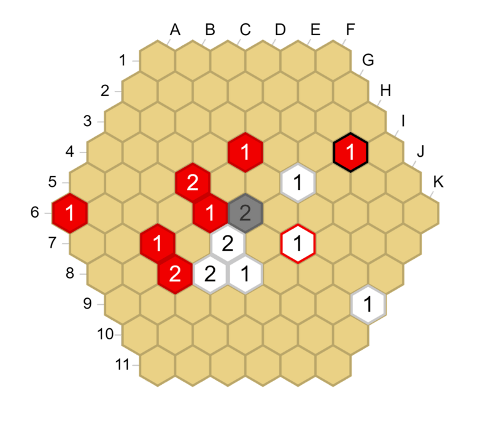
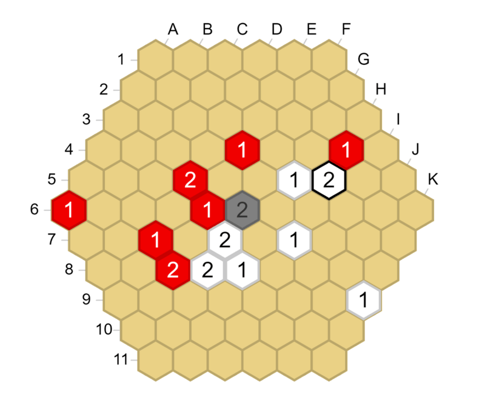

以下の文章は "[Advice for Tumbleweed beginners](/beginner-advice/)" の翻訳です。

# タンブルウィード初心者への上達アドバイス

このガイドの目的は、タンブルウィードのゲームでよくある初心者の間違いを回避し、ゲームをうまく進める方法を提供することです。よくある間違いは、形は良く見えてもほぼ瞬時にスタックを失う動きであったり、他のゲーム (特に囲碁) の形を真似ようとする「悪い習慣」などです。アドバイスのほとんどは、初心者が BGA で実際にプレイしているのを見て生まれました。間違いについて解説している章と、タンブルウィードの一般原則について説明している章をあわせて読むことをおすすめします。このガイドがゲームの流れを理解し、局面での指標を見つける役に立てば幸いです。

事前知識として「シールド」と「パリー」について解説したこちらの動画もご覧ください: [Basic defense strategies in Tumbleweed](https://www.youtube.com/watch?v=b1q3ZtuE-cc) (英語)

## 1スタックを相手スタックの隣に置くときは要注意

相手のスタック (駒、あるいは石) に隣接する1スタックを置く手は、次に相手のスタックを取る脅威を与えていないと通常は悪い手です。たとえば、左の図は赤が E5 に置いたところです。この手は次に隣の D5 を取る手にはなっていません。逆に白は E6 とすぐに赤の E5 を攻撃できます。赤には E5 を守るすべがありません。



<--->



1スタックは弱いので配置する際は注意が必要です。味方の「視線 (line of sight)」を追加することで、あとから1スタックを強固にすることができますが、最初は非常に脆弱になります。一般に、2スタックの方が相手に近づけて置くのに適しています。(ただし1スタックと同様、最初の攻撃が十分な脅威を与えていない場合は、脆弱になることもあります)

1スタックを近づけて置くのが常に悪手、というわけではありません。1スタックを置いた手が次に相手のスタックを取る手になっている例を挙げます。下の図は赤が E6 に置いたところ。



赤の E6 が D5 を攻撃しています。白は E6 を攻撃するために D6 または E5 を置く余裕がありません。もし D6 に置いた場合、赤は D5 を取ってしまえるからです。赤の E6 は1スタックを相手スタックに近づけて置く手ですが、好手になりえます。

## 相手の「デッド」スタックに御用心

ゲームの終盤になると、相手の1スタックが自分の陣地に残っていて、すぐに取れる状態にあることがよくあります。それらを取ったり、すでに確定したように見える自陣に手を入れるのは遅いと感じるかもしれません。ところが、このほぼ死んだ侵略者に対処する必要が多々あります。彼らが与えるダメージを過小評価してはいけません。スタックが盤面に残っている限り視線が追加され、相手の手を広げるからです。囲碁のような他のゲームよりもタンブルウィードでは、実際に相手のスタックを盤面から取り除くことが重要である、という事実に関連しています。スタックを取ると相手がスタックを置ける場所を減らせる、という追加の利点が大きいのです。生きる望みのなかった1スタックが活きる例を見てみましょう。



<--->



左図から白が K10 に置いた右図。赤は J9 に置いて I8 を守らないと壁が崩れてしまいます。しかし、赤 J9 の後、下図のように白は H10 または I10 で強力な両取りを仕掛けることができます。



## 視線が交差する箇所はとても重要

[Fundamental Shapes](/fundamental-shapes/#link) で説明されているように「リンク (link)」は、2つのスタック間の視線です。この視線上にあるマス目たちはゲームの基本的な構成要素であり、戦略の中心に据える必要があります。初心者が見逃すことが多い手の1つが、次の図のように自分のリンクと相手のリンクが交差しているときです。



2つのリンクは D4 で交差しています。このマス目は双方にとって重要なポイントなので先に確保した方が有利です。1つ考えられる手は、スタックを直接 D4 に置くことです。もう1つの可能性は、B2 や F6 に置くことで D4 に3番目の視線を追加することです。

実戦例を1つ見てみます。(AI の Tumblebot 同士の対局) 初手 B2 G8 から 2. E5 G3 3. E9 B3 と進んだ局面。



星印の C3 と E6 はどちらも赤のリンクと白のリンクが交差しているため、赤白双方にとって重要な場所です。この2つのどちらがより重要か、という話はいくぶん高度ですが、大まかに言えば E6 の方が中心に近く、もし赤が C3 を選び、白が E6 をプレイすると、赤は盤面の上部に集中しすぎて出遅れる可能性があります。上の図からの最善手は赤 E6、白 C3 と考えられます。

## 「強化」よりも「受け流し」

「強化 (reinforce、自分のスタックの高さを更新すること)」は他に選択肢がない場合を除いて悪い手です。たとえば、下図では赤の E5 スタックが攻撃されていますが、赤が E5 を2のスタックに強化するのはいい手ではありません。強化は白の攻撃に対し E5 がすぐに取られるのを防ぎますが、ただ防ぐだけで非常に受け身な手です。もっといい手は、たとえば右下の図のように C5 で「受け流す (parry)」ことです。C5 の視線を E5 に追加することで相手の視線の数を上回り (つまりもし相手が取ってきてもすぐに取り返せる)、さらに新しい視線、特に右下に続く C5-I11 の視線を開きます。また、C3 に視線を足してもいます。これは次に白が B3 と攻めてきたときの受けになっています。



<--->



経験則の1つは、1スタックを2スタックに強化する代わりに、新しい視線を加えられないか探すのがよい、ということです。

2スタックを置くときにも、近い将来、3スタックに強化する必要が出てきそうかどうかを予測してみてください。3スタックに強化するのも通常、あまり効率的ではないためです。

## バランスを取って進める

これから述べることは、個々の手についてというよりもゲーム全体の話です。(タンブルウィード以外のアブストラクトゲーム、特にテリトリー系のゲームに共通することです)

ゲームの中でプレイヤーは常に、自陣を広げようとする手と、自陣を強固にする手との狭間で迷い、最適な答えを探すことになるでしょう。タンブルウィードにおいては1つわかりやすい指標があります。置こうとしているスタックの高さです。スタックの高さは、定義上、その六角形のマスに何本の視線があるかを示しています。スタックの高さが、4、5、あるいは6のスタックを置く手は全く効率的ではありません。そのマスはすでにプレイヤーの陣地として確保されており、置いたスタックが新たな視線を開いて大きく自陣を広げることはないからです。

手番ごとにプレイヤーは何が正しい手か決断を迫られることになります。1スタックを置くのは欲張りすぎた手か、それとも素早く効率的な手なのか？いま置いたその3スタックは、遅くて非効率な手なのか、それとも自陣を固める堅実な手か？これらは多くの局面で自問するのにふさわしい質問であり、対局を重ねるにつれてうまく答えられるようになることでしょう。

## 相手より早く形を整える

少し高度な自陣の形、より具体的には角度、について話してこのガイドを締めくくりたいと思います。微妙なところが多く、これは紹介に過ぎませんが、ゲームの流れをつかむ上で非常に重要なトピックです。

さて、盤面を真っ直ぐに横切る2スタックの壁を作って自陣を確保できればわかりやすいのですが、相手がいる以上、なかなか実現しません。その結果、自陣はある程度角度のついた形状になることを余儀なくされます。何度かゲームをプレイして、同じ形の角がよく出てくることに気づいたかもしれません。鋭角よりも効率的な、鈍角のことです。



<--->



上の2つの図は、どちらも7つのスタックで (左図の F7 にある1スタックは数えないとして) 赤の自陣の境界線を守っています。比べていただくと、左図の鈍角の方が右図の鋭角よりも同じスタックの数ではるかに効率よく広い自陣を作っています。

左図の C4 にある赤の3スタックのような鈍角の角にあたるスタックは自然に配置できます。壁の両側 (C6-C5 および D4-G4) からの視線と、もう1つ視線を追加してくれる F7 のようなスタックが必要なだけです。反面、右図の D4 のような赤の4スタックを置くのは困難です。この図の時点で D4 に利いている味方の視線は2つしかなく、4スタックを置くのに必要な4つの視線のうち2つは相手に取られている、ということになります。これは狙ってできる形ではありません。

相手から取られないために鈍角は3スタック、鋭角は4スタックが必要になります。必ずしもそれぞれの高さのスタックを置く必要はなく、角に視線が集まっていれば十分という場合もあります。必要になる高さが低いことからも鈍角の方が好ましいことがわかります。

自陣の角にあたる場所は重要である、ということは心に留めておきましょう。ゲーム中にこの角への注意を怠ってはなりません。どこが角になるのか、早めに決めておくことが望ましいと言えます。(自陣が複数に分断されているときなど、場合によっては複数の角を気にすることになります) もちろん相手の動きに応じて計画を変更することもあるかもしれませんが、角の場所を意識しておくことでゲームの流れが見えやすくなるはずです。

testing_qwerty (赤) と komacchin (白) の[実戦](https://tumbleweed.games/log/4160/15/)を見てみましょう。



<--->



赤が H4 にスタックを置いて白の1スタック H7 を取ろうとしているところです。白は H7 を守る H5 で答えました。この H5 は複数の狙いを持った手です。まず、D1-K8 に新しい視線を開きます。さらに、G5 に3つ目の視線を向けています。もし赤が次に G4 から F4 のような手で G5 を囲んで取ろうとしても、すでに白は G5 を自陣の鈍角の角にする準備ができています。
